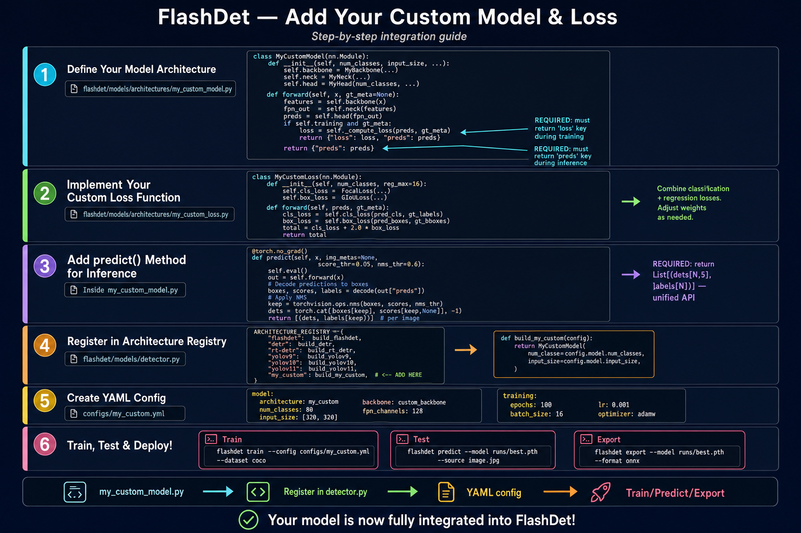
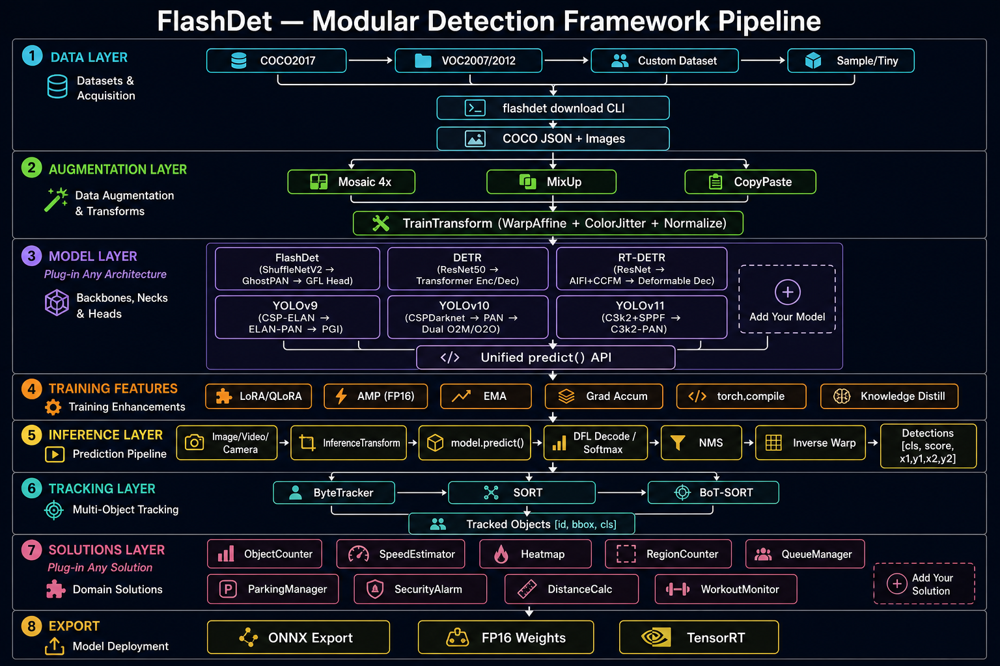
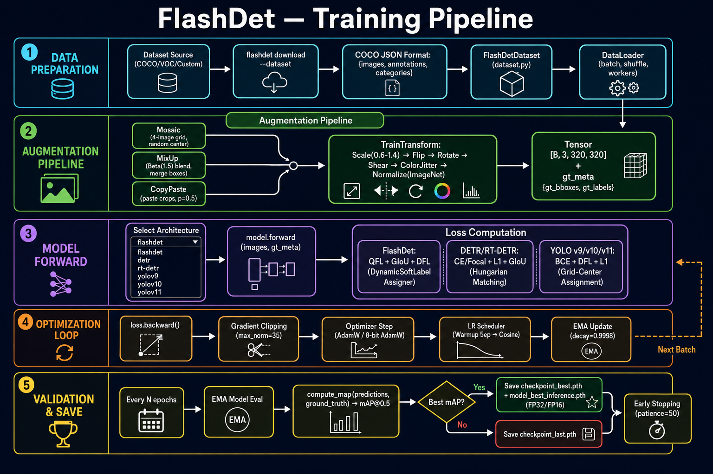
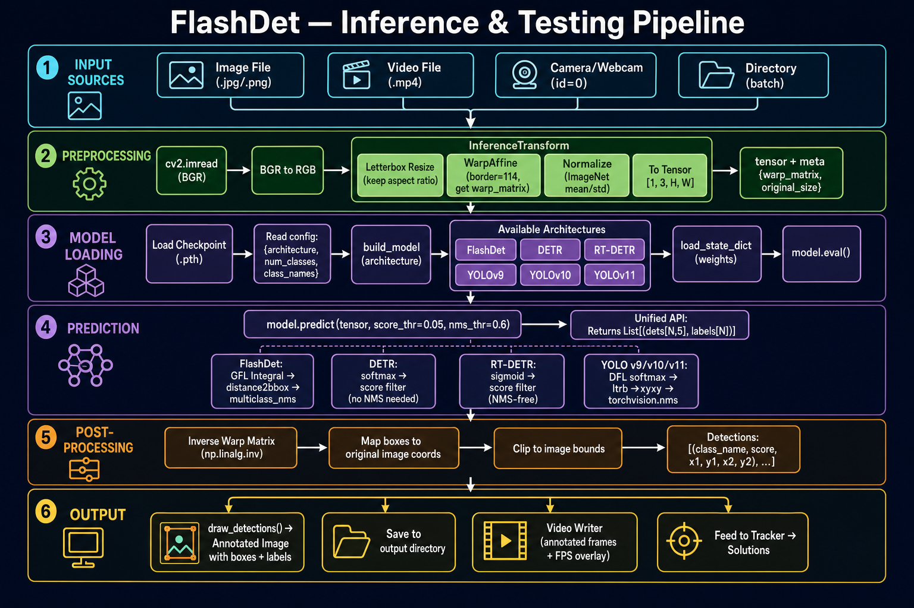
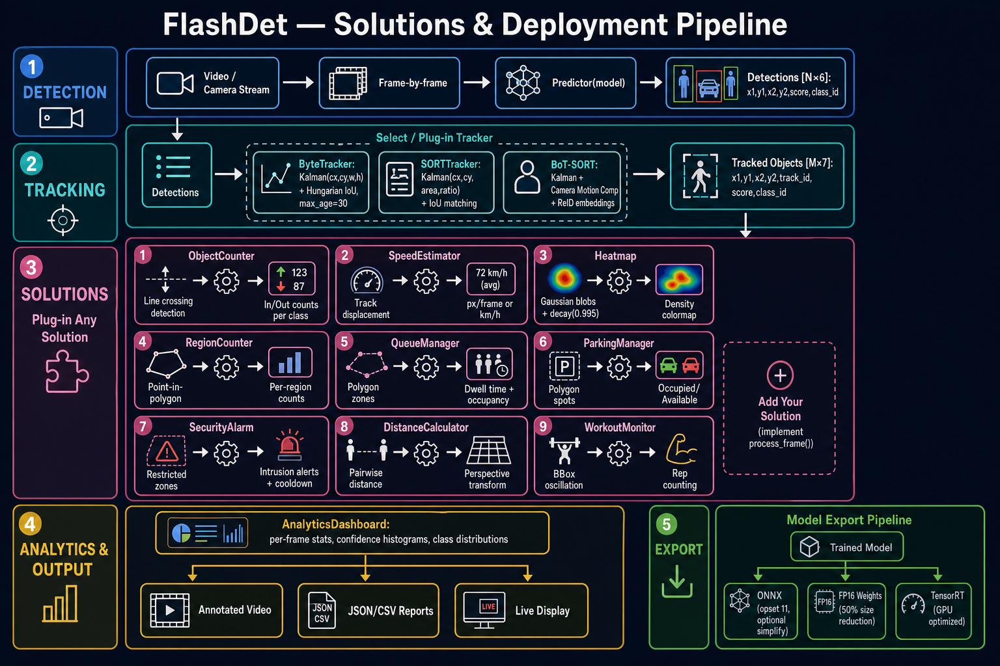
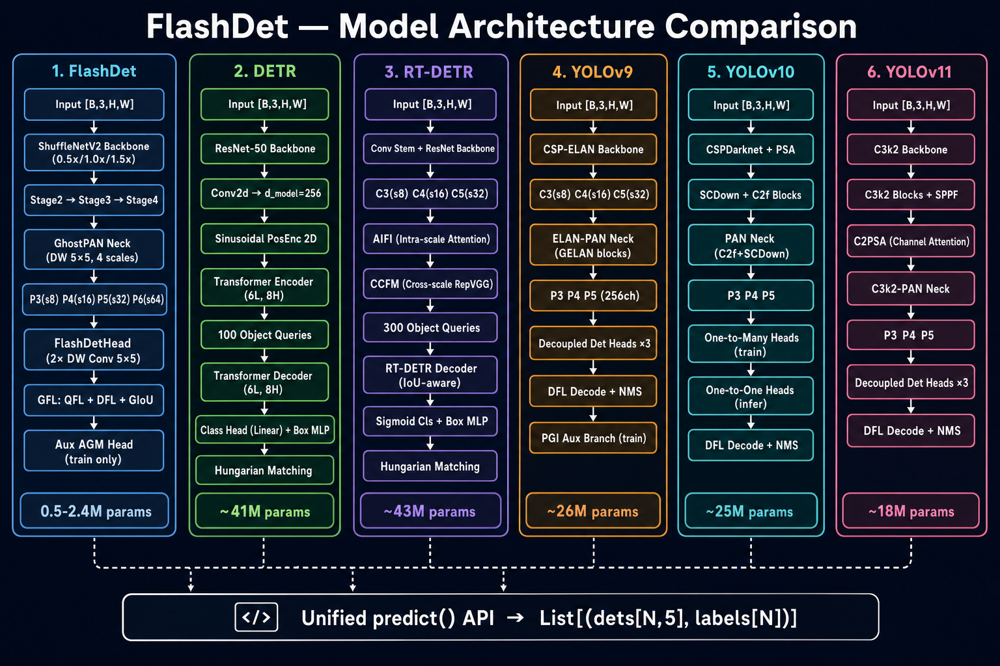

# Models

## FlashDet (Default)

YOLO26-based lightweight detector — the default model for production deployment.

| Model | Backbone | Inference Params | FP16 Size | Notes |
|-------|----------|-----------------|-----------|-------|
| **FlashDet-P** (Pico) | ShuffleNetV2-0.5x + GhostPAN | ~298K | **0.57 MB** | Sub-1MB, edge/MCU deployment |
| **FlashDet-N** (Nano) | YOLOv11 (w=0.25, d=0.33) | ~1.06M | 2.01 MB | Lightweight |
| **FlashDet-S** (Small) | YOLOv11 (w=0.50, d=0.33) | ~5.4M | 10.3 MB | Balanced |
| **FlashDet-M** (Medium) | YOLOv11 (w=1.00, d=0.67) | ~18M | 34.3 MB | High accuracy |

### FlashDet-P (Pico) — Sub-1MB Model

FlashDet-P is designed for extreme edge deployment where model size must be under 1MB:

- **ShuffleNetV2-0.5x** backbone (channel shuffle + depthwise, ImageNet pretrained)
- **GhostPAN** neck with 64-channel output (Ghost modules for cheap features)
- **Depthwise-separable E2E dual head** (replaces full convolutions with DW-conv + pointwise)
- Same **STAL + ProgLoss** training recipe as larger FlashDet variants

```python
from flashdet.models.architectures.flashdet import FlashDet

pico = FlashDet(num_classes=80, size="p")
info = pico.get_model_info()
print(f"Inference FP16 size: {info['inference_fp16_mb']:.2f} MB")  # 0.57 MB
```

### Training

```python
from flashdet import Trainer

trainer = Trainer(
    model_size="p",          # "p" (Pico), "n", "s", "m"
    train_images="data/train",
    val_images="data/val",
    epochs=100,
)
trainer.train()
```

### Inference

```python
from flashdet import Predictor

predictor = Predictor(model_path="workspace/best.pth", device="cuda")
results = predictor.predict("photo.jpg")
```

---

## Using Different Architectures

FlashDet provides multiple detection architectures. Each can be used independently for training and inference.

### Architecture Overview

| Architecture | Type | Key Feature | Best For |
|-------------|------|-------------|----------|
| **FlashDet** | CNN | Ultra-lightweight, ShuffleNetV2 | Edge/mobile deployment |
| **DETR** | Transformer | End-to-end, no NMS | Research, high accuracy |
| **RT-DETR** | Transformer | Real-time DETR | Speed + accuracy balance |
| **YOLOv9** | CNN | PGI (Programmable Gradient Info) | General detection |
| **YOLOv10** | CNN | NMS-free, PSA attention | Real-time no postprocess |
| **YOLOv11** | CNN | C2PSA attention blocks | Latest YOLO features |
| **GroundingDINO** | Multimodal | Text-guided open-vocabulary | Zero-shot detection |

---

## DETR (Detection Transformer)

End-to-end detection with transformer and Hungarian matching — no NMS required.

### Training

```python
from flashdet.models.architectures import DETR
import torch
import numpy as np

model = DETR(
    num_classes=10,
    num_queries=100,          # number of object queries
    d_model=256,              # transformer hidden dim
    nhead=8,                  # attention heads
    num_encoder_layers=6,
    num_decoder_layers=6,
    dim_feedforward=2048,
    backbone="resnet50",      # "resnet18", "resnet34", "resnet50", "resnet101"
    pretrained_backbone=True,
)

# Training step
model.train()
images = torch.randn(4, 3, 512, 512)
gt_meta = {
    "img": images,
    "gt_bboxes": [np.array([[x1, y1, x2, y2]], dtype=np.float32) for _ in range(4)],
    "gt_labels": [np.array([class_id], dtype=np.int64) for _ in range(4)],
}
output = model(images, gt_meta=gt_meta)
loss = output["loss"]        # scalar loss (CE + L1 + GIoU)
loss.backward()
```

### Inference

```python
model.eval()
results = model.predict(images, score_thr=0.5)
# results: List[Dict] with keys "boxes", "scores", "labels"
for det in results:
    print(det["boxes"])    # [N, 4] in xyxy format
    print(det["scores"])   # [N] confidence scores
    print(det["labels"])   # [N] class indices
```

---

## RT-DETR (Real-Time DETR)

Efficient transformer detector with hybrid encoder — faster than DETR while maintaining accuracy.

### Training

```python
from flashdet.models.architectures import RTDETR

model = RTDETR(
    num_classes=10,
    backbone="resnet50",       # "resnet18", "resnet34", "resnet50"
    hidden_dim=256,
    nhead=8,
    num_encoder_layers=1,
    num_decoder_layers=6,
    dim_feedforward=1024,
    num_queries=300,
    num_csp_blocks=3,
    pretrained_backbone=True,
)

model.train()
images = torch.randn(2, 3, 640, 640)
gt_meta = {
    "img": images,
    "gt_bboxes": [np.array([[50, 50, 200, 200]], dtype=np.float32),
                  np.array([[100, 100, 300, 300]], dtype=np.float32)],
    "gt_labels": [np.array([0], dtype=np.int64),
                  np.array([5], dtype=np.int64)],
}
output = model(images, gt_meta=gt_meta)
output["loss"].backward()
```

### Inference

```python
model.eval()
results = model.predict(images, score_thr=0.5)
```

---

## YOLOv9

Features Programmable Gradient Information (PGI) for better gradient flow during training.

### Training

```python
from flashdet.models.architectures import YOLOv9

model = YOLOv9(
    num_classes=10,
    width_mult=0.5,     # channel multiplier
    depth_mult=0.34,    # depth multiplier
    use_pgi=True,       # enable PGI auxiliary branch
)

model.train()
images = torch.randn(2, 3, 640, 640)
output = model(images)
# output["preds"]: list of prediction tensors per scale
# output["aux_preds"]: PGI auxiliary predictions (training only)
```

### Inference

```python
model.eval()
output = model(images)
# output["preds"]: list of prediction tensors
# No "aux_preds" at inference — PGI branch is training-only
```

---

## YOLOv10

NMS-free detection with dual label assignment (one-to-many for training, one-to-one for inference).

### Training

```python
from flashdet.models.architectures import YOLOv10

model = YOLOv10(
    num_classes=10,
    width_mult=0.5,
    depth_mult=0.34,
    use_psa=True,       # Partial Self-Attention module
)

model.train()
images = torch.randn(2, 3, 640, 640)
output = model(images)
# output["preds"]: one-to-one head predictions (for NMS-free inference)
# output["o2m_preds"]: one-to-many head predictions (training supervision only)
```

### Inference

```python
model.eval()
output = model(images)
# output["preds"]: one-to-one predictions — no NMS needed!
# "o2m_preds" not present at inference
```

---

## YOLOv11

Latest YOLO with C2PSA (Cross-Stage Partial Self-Attention) blocks.

### Training

```python
from flashdet.models.architectures import YOLOv11

model = YOLOv11(
    num_classes=10,
    width_mult=0.5,
    depth_mult=0.34,
    use_c2psa=True,     # C2PSA attention blocks
)

model.train()
images = torch.randn(2, 3, 640, 640)
output = model(images)
# output["preds"]: list of prediction tensors per scale
```

### Inference

```python
model.eval()
output = model(images)
```

---

## GroundingDINO

Open-vocabulary text-guided detection — detect any object described by text.

### Training

```python
from flashdet.models.architectures import GroundingDINO

model = GroundingDINO(
    num_queries=900,
    d_model=256,
    nhead=8,
    num_encoder_layers=3,
    num_decoder_layers=6,
    backbone="resnet50",
    pretrained_backbone=True,
    vocab_size=30522,       # BERT vocabulary
    text_embed_dim=256,
    max_text_len=77,
    text_encoder_depth=3,
)

model.train()
images = torch.randn(2, 3, 512, 512)
text_ids = torch.randint(0, 30522, (2, 10))    # tokenized text prompts
text_mask = torch.ones(2, 10)
gt_meta = {
    "img": images,
    "gt_bboxes": [np.array([[50, 50, 200, 200]], dtype=np.float32),
                  np.array([[100, 100, 300, 300]], dtype=np.float32)],
    "gt_labels": [np.array([0], dtype=np.int64),
                  np.array([5], dtype=np.int64)],
}
output = model(images, text_ids=text_ids, text_mask=text_mask, gt_meta=gt_meta)
output["loss"].backward()
```

### Inference

```python
model.eval()
results = model.predict(images, text_ids=text_ids, text_mask=text_mask, score_thr=0.3)
# results: List[Dict] with "boxes", "scores", "labels"
```

---

## Choosing a Model

| Use Case | Recommended Model | Why |
|----------|-------------------|-----|
| MCU/Browser/Sub-1MB | FlashDet-P (Pico) | 0.57 MB FP16, depthwise efficient |
| Mobile/Edge deployment | FlashDet-N (Nano) | 2 MB FP16, lightweight |
| General real-time | FlashDet-S or YOLOv10 | Good speed/accuracy |
| High accuracy | DETR or RT-DETR | Transformer-based |
| No post-processing | YOLOv10 | NMS-free |
| Open-vocabulary | GroundingDINO | Text-guided |
| Custom fine-tuning | FlashDet + LoRA | Efficient adaptation |

---

## Common Training Pattern

All architectures follow the same forward API pattern:

```python
# Training
model.train()
output = model(images, gt_meta=gt_meta)
loss = output["loss"]
loss.backward()

# Inference
model.eval()
output = model(images)
preds = output["preds"]

# Predict (high-level, returns boxes/scores/labels)
results = model.predict(images, score_thr=0.5)
```

---

## Registry System

Register and build models dynamically:

```python
from flashdet.registry import BACKBONES

# All architectures are auto-registered
model = BACKBONES.build("DETR", num_classes=10, num_queries=100)
model = BACKBONES.build("YOLOv10", num_classes=10, use_psa=True)
model = BACKBONES.build("RTDETR", num_classes=10)

# List available architectures
print(BACKBONES.list())
```

---

## Adding Your Custom Model & Loss

FlashDet is designed to be modular — you can plug in **any** detection architecture with **any** loss function by following these 6 steps.

> **Visual Guide:** See `assets/flashdet_add_custom_model_guide.png` for the full pipeline diagram.



---

### Step 1: Define Your Model Architecture

Create a new file at `flashdet/models/architectures/my_custom_model.py`.

Your model **must** follow the FlashDet forward contract:

- **Training:** return `{"loss": <scalar>, "preds": <tensor>}`
- **Inference:** return `{"preds": <tensor>}`

```python
import torch
import torch.nn as nn
from typing import Dict, List, Tuple, Optional


class MyCustomModel(nn.Module):
    """Custom detection model for FlashDet integration."""

    def __init__(self, num_classes: int, input_size=(640, 640), **kwargs):
        super().__init__()
        self.num_classes = num_classes
        self.input_size = input_size

        # 1) Backbone — extract multi-scale features
        self.backbone = MyBackbone(...)

        # 2) Neck / FPN — fuse multi-scale features
        self.neck = MyNeck(...)

        # 3) Detection Head — classify + regress boxes
        self.head = MyHead(num_classes=num_classes, ...)

        # 4) Loss function (see Step 2)
        self.loss_fn = MyCustomLoss(num_classes=num_classes)

    def forward(
        self,
        x: torch.Tensor,
        gt_meta: Dict = None,
    ) -> Dict:
        """
        Forward pass.

        Args:
            x: Input tensor [B, 3, H, W].
            gt_meta: Ground truth metadata dict with keys:
                - "gt_bboxes": list of np.ndarray [N, 4] in xyxy format per image
                - "gt_labels": list of np.ndarray [N] per image
                - "img": input tensor (auto-set by trainer)

        Returns:
            Training: {"loss": scalar_loss, "preds": raw_predictions}
            Inference: {"preds": raw_predictions}
        """
        features = self.backbone(x)
        fpn_out = self.neck(features)
        preds = self.head(fpn_out)

        if self.training and gt_meta is not None:
            gt_meta["img"] = x
            loss = self.loss_fn(preds, gt_meta)
            return {"loss": loss, "preds": preds}  # REQUIRED keys

        return {"preds": preds}  # REQUIRED key
```

> **Key Contract:**
> - `forward()` **must** return a dict with `"loss"` key during training
> - `forward()` **must** return a dict with `"preds"` key during inference
> - The trainer calls `output["loss"].backward()` — so loss must be a differentiable scalar

---

### Step 2: Implement Your Custom Loss Function

Create `flashdet/models/architectures/my_custom_loss.py`.

A detection loss typically combines classification loss + box regression loss:

```python
import torch
import torch.nn as nn
import torch.nn.functional as F
import numpy as np
from typing import Dict, List


class MyCustomLoss(nn.Module):
    """Custom detection loss combining classification and regression."""

    def __init__(self, num_classes: int, cls_weight: float = 1.0, box_weight: float = 2.0):
        super().__init__()
        self.num_classes = num_classes
        self.cls_weight = cls_weight
        self.box_weight = box_weight

        # Classification: Focal Loss, BCE, Cross-Entropy, QFL, etc.
        self.cls_loss = FocalLoss(alpha=0.25, gamma=2.0)

        # Box regression: GIoU, DIoU, CIoU, L1, SmoothL1, etc.
        self.box_loss = GIoULoss()

    def forward(self, preds, gt_meta: Dict) -> torch.Tensor:
        """
        Compute total loss.

        Args:
            preds: Raw predictions from detection head.
            gt_meta: Ground truth with "gt_bboxes" and "gt_labels".

        Returns:
            Scalar loss tensor (must be differentiable).
        """
        pred_cls = preds["cls_scores"]     # [B, num_anchors, num_classes]
        pred_boxes = preds["bbox_preds"]   # [B, num_anchors, 4]

        gt_bboxes = gt_meta["gt_bboxes"]   # list of np.ndarray [N, 4]
        gt_labels = gt_meta["gt_labels"]   # list of np.ndarray [N]

        # 1) Assign ground truth to predictions (e.g. IoU-based, Hungarian, ATSS)
        # ... your assignment logic here ...

        # 2) Classification loss
        cls_loss = self.cls_loss(pred_cls, assigned_labels)

        # 3) Box regression loss (only for positive samples)
        box_loss = self.box_loss(pred_boxes[pos_mask], gt_boxes[pos_mask])

        # 4) Combine with weights
        total_loss = self.cls_weight * cls_loss + self.box_weight * box_loss

        return total_loss
```

> **Common Loss Combinations:**
>
> | Architecture Style | Classification | Box Regression | Assignment |
> |-------------------|---------------|----------------|------------|
> | Anchor-free (YOLO) | BCE / Focal | DFL + GIoU | Grid-center TAL |
> | Anchor-free (FCOS) | Focal Loss | GIoU + Centerness | ATSS |
> | Transformer (DETR) | CE / Focal | L1 + GIoU | Hungarian Matching |
> | FlashDet (GFL) | QFL | DFL + GIoU | DynamicSoftLabel |

---

### Step 3: Add `predict()` Method for Inference

Add a `predict()` method to your model class. This is the **unified inference API** that all FlashDet models must implement.

**Return format:** `List[Tuple[dets, labels]]` where:
- `dets`: tensor `[N, 5]` — each row is `[x1, y1, x2, y2, score]`
- `labels`: tensor `[N]` — class index per detection

```python
import torchvision


class MyCustomModel(nn.Module):
    # ... __init__ and forward from Step 1 ...

    @torch.no_grad()
    def predict(
        self,
        x: torch.Tensor,
        img_metas=None,
        score_thr: float = 0.05,
        nms_thr: float = 0.6,
    ) -> List[Tuple[torch.Tensor, torch.Tensor]]:
        """
        Run inference and return detections per image.

        Args:
            x: Input tensor [B, 3, H, W].
            img_metas: Optional image metadata.
            score_thr: Minimum confidence score to keep.
            nms_thr: NMS IoU threshold.

        Returns:
            List of (dets[N, 5], labels[N]) tuples, one per image.
            dets columns: [x1, y1, x2, y2, score]
        """
        self.eval()
        out = self.forward(x)

        # Decode raw predictions to boxes + scores + labels
        # (this is model-specific — adapt to your head's output format)
        boxes, scores, labels = self._decode(out["preds"], x.shape[2:])

        results = []
        B = x.shape[0]
        for b in range(B):
            # Filter by score threshold
            mask = scores[b] > score_thr
            b_boxes = boxes[b][mask]
            b_scores = scores[b][mask]
            b_labels = labels[b][mask]

            # Apply NMS (skip if your model is NMS-free like DETR)
            keep = torchvision.ops.nms(b_boxes, b_scores, nms_thr)
            b_boxes = b_boxes[keep]
            b_scores = b_scores[keep]
            b_labels = b_labels[keep]

            # Pack into (dets[N,5], labels[N]) format
            dets = torch.cat([b_boxes, b_scores.unsqueeze(-1)], dim=-1)
            results.append((dets, b_labels))

        return results

    def _decode(self, preds, input_hw):
        """Decode raw head output to (boxes_xyxy, scores, labels).
        Implement based on your head's output format."""
        # Example for a simple head outputting [B, num_anchors, 4+num_classes]:
        pred_boxes = preds[..., :4]          # [B, A, 4]
        pred_scores = preds[..., 4:].sigmoid()  # [B, A, C]
        scores, labels = pred_scores.max(-1)    # [B, A]
        return pred_boxes, scores, labels
```

---

### Step 4: Register in Architecture Registry

Open `flashdet/models/detector.py` and add your model to two places:

**4a. Add to `ARCHITECTURE_REGISTRY`:**

```python
ARCHITECTURE_REGISTRY = {
    "flashdet": "FlashDet",
    "detr": "DETR",
    "rt-detr": "RTDETR",
    "rtdetr": "RTDETR",
    "yolov9": "YOLOv9",
    "yolov10": "YOLOv10",
    "yolov11": "YOLOv11",
    "grounding-dino": "GroundingDINO",
    "groundingdino": "GroundingDINO",
    "my_custom": "MyCustomModel",          # <-- ADD THIS LINE
}
```

**4b. Add to `build_model()` function:**

```python
def build_model(config, architecture: str = None):
    # ... existing code ...

    from flashdet.models.architectures import (
        DETR, RTDETR, YOLOv9, YOLOv10, YOLOv11, GroundingDINO
    )
    from flashdet.models.architectures.my_custom_model import MyCustomModel  # ADD

    cls_map = {
        "DETR": DETR,
        "RTDETR": RTDETR,
        "YOLOv9": YOLOv9,
        "YOLOv10": YOLOv10,
        "YOLOv11": YOLOv11,
        "GroundingDINO": GroundingDINO,
        "MyCustomModel": MyCustomModel,    # <-- ADD THIS LINE
    }
    cls = cls_map[class_name]
    num_classes = config.model.num_classes
    return cls(num_classes=num_classes)
```

> **Why a registry?** The `Predictor` and `Trainer` classes use `build_model()` to reconstruct any model from a checkpoint. The registry lets them look up your model by its string name.

---

### Step 5: Create YAML Config

Create `configs/my_custom.yml`:

```yaml
model:
  architecture: my_custom
  num_classes: 80
  input_size: [640, 640]
  backbone: custom_backbone
  fpn_channels: 256

training:
  epochs: 100
  batch_size: 16
  lr: 0.001
  optimizer: adamw
  weight_decay: 0.0001
  warmup_epochs: 5
  scheduler: cosine
  amp: true                    # automatic mixed precision
  ema: true                    # exponential moving average
  grad_clip: 35.0              # gradient clipping max norm

augmentation:
  mosaic: true
  mixup: true
  copy_paste: false
  scale: [0.6, 1.4]
  flip_prob: 0.5

dataset:
  name: coco
  train_ann: data/coco/annotations/instances_train2017.json
  val_ann: data/coco/annotations/instances_val2017.json
  train_img: data/coco/train2017
  val_img: data/coco/val2017
```

---

### Step 6: Train, Test & Deploy

Once registered, your custom model works with the full FlashDet CLI and Python API:

**Train:**

```bash
# CLI
flashdet train --config configs/my_custom.yml --dataset coco

# Python
python train.py --arch my_custom --dataset coco --epochs 100 --batch_size 16
```

**Inference:**

```bash
# CLI
flashdet predict --model workspace/my_custom/checkpoint_best.pth --source image.jpg

# Python
python test.py --model workspace/my_custom/checkpoint_best.pth --img photo.jpg
```

**Python API:**

```python
from flashdet import Predictor

predictor = Predictor(model_path="workspace/my_custom/checkpoint_best.pth", device="cuda")
results = predictor.predict("photo.jpg")

for det in results:
    boxes = det["boxes"]     # [N, 4] xyxy
    scores = det["scores"]   # [N]
    labels = det["labels"]   # [N]
```

**Export:**

```bash
flashdet export --model workspace/my_custom/checkpoint_best.pth --format onnx
```

---

### Integration Checklist

Use this checklist when adding any new model:

- [ ] **Model file** created at `flashdet/models/architectures/my_custom_model.py`
- [ ] **`__init__`** accepts `num_classes` (required) and other hyperparameters
- [ ] **`forward(x, gt_meta)`** returns `{"loss": ..., "preds": ...}` in training
- [ ] **`forward(x)`** returns `{"preds": ...}` in inference
- [ ] **Custom loss** implemented (can be inline or separate file)
- [ ] **`predict(x, score_thr, nms_thr)`** returns `List[Tuple[dets[N,5], labels[N]]]`
- [ ] **Registered** in `ARCHITECTURE_REGISTRY` in `detector.py`
- [ ] **Builder** added to `cls_map` in `build_model()` function
- [ ] **YAML config** created in `configs/`
- [ ] **Tested** training: `output["loss"].backward()` succeeds
- [ ] **Tested** inference: `model.predict(x)` returns correct format

---

### Complete Example: EfficientDet-Lite

Here's a minimal but complete example of adding a custom model:

```python
# flashdet/models/architectures/efficientdet_lite.py

import torch
import torch.nn as nn
import torch.nn.functional as F
import torchvision
from typing import Dict, List, Tuple, Optional
import numpy as np


class EfficientDetLiteLoss(nn.Module):
    def __init__(self, num_classes):
        super().__init__()
        self.num_classes = num_classes

    def forward(self, preds, gt_meta):
        cls_preds, box_preds = preds
        device = cls_preds.device
        B = cls_preds.shape[0]
        total_cls_loss = torch.tensor(0.0, device=device)
        total_box_loss = torch.tensor(0.0, device=device)
        num_pos = 0

        for b in range(B):
            gt_boxes_np = gt_meta["gt_bboxes"][b]
            gt_labels_np = gt_meta["gt_labels"][b]
            if len(gt_boxes_np) == 0:
                continue
            gt_boxes = torch.from_numpy(gt_boxes_np).float().to(device)
            gt_labels = torch.from_numpy(gt_labels_np).long().to(device)

            # Simple IoU assignment
            ious = torchvision.ops.box_iou(box_preds[b], gt_boxes)
            max_iou, assigned_gt = ious.max(dim=1)
            pos_mask = max_iou > 0.5

            if pos_mask.sum() > 0:
                pos_cls = cls_preds[b][pos_mask]
                pos_labels = gt_labels[assigned_gt[pos_mask]]
                total_cls_loss += F.cross_entropy(pos_cls, pos_labels)

                pos_boxes = box_preds[b][pos_mask]
                target_boxes = gt_boxes[assigned_gt[pos_mask]]
                total_box_loss += F.smooth_l1_loss(pos_boxes, target_boxes)
                num_pos += pos_mask.sum().item()

        num_pos = max(num_pos, 1)
        return (total_cls_loss + 2.0 * total_box_loss) / num_pos


class EfficientDetLite(nn.Module):
    def __init__(self, num_classes=80, input_size=(512, 512)):
        super().__init__()
        self.num_classes = num_classes
        self.input_size = input_size

        backbone = torchvision.models.efficientnet_b0(pretrained=True)
        self.backbone = backbone.features
        self.neck = nn.Conv2d(1280, 256, 1)
        self.cls_head = nn.Conv2d(256, num_classes, 3, padding=1)
        self.box_head = nn.Conv2d(256, 4, 3, padding=1)
        self.loss_fn = EfficientDetLiteLoss(num_classes)

    def forward(self, x, gt_meta=None):
        feat = self.backbone(x)
        feat = self.neck(feat)
        cls_out = self.cls_head(feat).flatten(2).permute(0, 2, 1)
        box_out = self.box_head(feat).flatten(2).permute(0, 2, 1)

        if self.training and gt_meta is not None:
            gt_meta["img"] = x
            loss = self.loss_fn((cls_out, box_out), gt_meta)
            return {"loss": loss, "preds": (cls_out, box_out)}
        return {"preds": (cls_out, box_out)}

    @torch.no_grad()
    def predict(self, x, img_metas=None, score_thr=0.05, nms_thr=0.6):
        self.eval()
        out = self.forward(x)
        cls_out, box_out = out["preds"]
        results = []
        for b in range(x.shape[0]):
            scores, labels = cls_out[b].softmax(-1).max(-1)
            mask = scores > score_thr
            b_boxes = box_out[b][mask]
            b_scores = scores[mask]
            b_labels = labels[mask]
            if b_boxes.numel() > 0:
                keep = torchvision.ops.nms(b_boxes, b_scores, nms_thr)
                dets = torch.cat([b_boxes[keep], b_scores[keep].unsqueeze(-1)], -1)
                results.append((dets, b_labels[keep]))
            else:
                results.append((torch.zeros(0, 5, device=x.device),
                                torch.zeros(0, dtype=torch.long, device=x.device)))
        return results
```

Then register it:

```python
# In detector.py
ARCHITECTURE_REGISTRY["efficientdet-lite"] = "EfficientDetLite"

# In build_model() cls_map:
from flashdet.models.architectures.efficientdet_lite import EfficientDetLite
cls_map["EfficientDetLite"] = EfficientDetLite
```

---

## Pipeline Diagrams

### Complete Framework Pipeline

Full FlashDet pipeline from data ingestion to model export, with plug-in points for custom models and solutions.



---

### Training Pipeline

Detailed training flow: data preparation, augmentation (Mosaic/MixUp/CopyPaste), architecture-specific loss computation, optimization loop, validation, and checkpointing.



---

### Inference & Testing Pipeline

Full inference flow: input sources, preprocessing with letterbox/warp, model loading from checkpoint, unified `predict()` API, post-processing, and output.



---

### Solutions & Deployment Pipeline

Detection → tracking (ByteTracker/SORT/BoT-SORT) → 9 built-in solutions with plug-in extensibility, plus export options (ONNX/FP16/TensorRT).



---

### Model Architecture Comparison

Side-by-side comparison of all 6 architectures (FlashDet, DETR, RT-DETR, YOLOv9, YOLOv10, YOLOv11) showing internal layer structure, converging at the unified `predict()` API.



---

### Custom Model Integration Guide

Step-by-step visual guide for adding any custom model with custom loss into the FlashDet framework.


---

## OBB (Oriented Bounding Box) Detection

For detecting rotated objects (aerial imagery, document text, etc.):

```python
from flashdet.models.head import OBBHead

obb_head = OBBHead(
    num_classes=15,
    in_channels=96,
    feat_channels=96,
    num_angle_bins=180,
    angle_mode="bins",  # or "direct"
)
```
